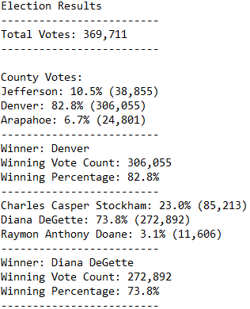

# Election_Analyisis_Challenge

## Overview of Election Audit:
The purpose of this election summary is to help Seth and Tom know the results of the election to know the overall result but also make some deeper analysis in a deeper level.

## Election-Audit Results:
Following up, we´ll show some of the final results from the voting exercise. The summary is give in the following picture:

* Number of votes in the most recent congressional election: **369,711**
* Number of votes and the percentage of total votes for each county:
          County Jefferson | votes: **38855 (10.5%)**
          County Denver    | votes: **306055 (82.8%)**
          County Arapahoe  | votes: **24801 (6.7%)**
* County with the largest amount of votes: **Denver**
* Number of votes and the percentage of the total votes each candidate received:
          Charles          | **85213 (23%)**
          Diana            | **272892 (73.8%)**
          Raymon           | **11606 (3.1%)**
* Candidate who won the election, what was their vote count, and what was their percentage of the total votes:
 The candidate that won the elction is Diana DeGette with a vote count of 272,892 representing this 73.8% of the votes.

## Election-Audit Summary:

1. For future voting extercises, the code could be used really easily if the data type and format maintains and the code oer se has little or no dependencies on changes to the code; if we have more counties or more voters or more candidates, the code will still be able to work.
2. In the future we could also try to understand the winner per county to see if that would also imply that Diana was the winner or maybe Diana was a winner only for Denver county.In this case, I would add a for loop statement before counting the number of candidates loop; this for loop would have to work for every candidate´s name wihtout putting it manually to continue working with the overall percentages to continue accomplishing bullet "1.".
